# CS542200 Parallel Programming HW2 Report

- 學號：108022138
- 姓名：楊宗諺

## Implementation

### Pthread version

在 single node pthread version 中，我讓 main thread 生成數條 worker threads 分別去完成各個座標的計算工作（這邊生成 thread 的數量為 CPU 的 core 數），每條 worker thread 的工作內容如下：

- 先 acquire 需要計算的座標，這邊座標的獲取順序為 sequential，沒有特別根據每個座標的 load 來做排序。
- 得到對應的 complex number 後，根據 Mandelbrot set 的計算方式 iterative 地去計算下一輪的 complex number 直到 iteration 次數超過給定的最大值，抑或者是該複數的絕對值超過 4。
- 將總 iteration 次數記錄下來並重新 acquire 新的計算工作。

這邊 acquire 計算工作的實作，我主要是將目前需要計算的座標定義在 global scope，讓所有 worker threads 都可以透過 shared memory 去 access 計算工作。然而由於其 shared 的特性，我也加上了 pthread library 支援的 mutex lock 來避免 synchronization 的問題。

最後當所有計算工作都完成之後，讓 main thread 將所有 worker threads 都 join 回來，並根據記錄到的所有座標的 iteration 次數來畫出最後的 png file。

### Hybrid version

相較於 Single node 的環境，在 hybrid version 中需要著重的點在於 processes 之間的 load balance，因此在分配 processes 之間的計算工作時，我先將圖片根據高度來做 partition，之後分別分配高度為 `i`、`i + m`、`i + 2 * m`、... 的計算區塊給 rank id 為 `i` 的 process 處理（這邊 `m` 為平行度）。相較於單純平分切區塊的方式，這樣的分配方式可以有效地解決計算 loading 比較重的 pixels 過於偏向圖片的某一側，進而導致某些區塊的計算工作量特別大的問題。

而對於單一 process 的工作分配來說，處理的方式基本上跟 single node version 相同，生成數條 worker threads 來處理單一 process 被分配到的計算工作，只是這邊 thread programming 的實作是使用 OpenMP 的 API，而非 Pthread。

當所有 processes 被分配到的計算工作都完成之後，接著透過 MPI 溝通的 API（`MPI_Send`、`MPI_Recv`）將所有計算結果回傳給 rank 0 的 process，最後再由該 process 統一整理後畫出最後的 png file。

### Vectorization optimization

觀察 Mandelbrot set 的計算方式，我們可以發現不同座標的計算本身是 independent 且 vectorizable 的，因此在上面兩個版本的計算實作當中，我有使用到 vectorization 的 technique 來做優化。在滿足 boundary condition 的情況下，利用 SSE 的 vector instruction sets 來在一次的計算工作內 acquire 兩個座標點，並同時處理這兩個座標的 double precision 浮點數運算。

## Experiment & Analysis

### Methodology

這邊採用的系統配置為課堂所提供的 Cluster。在計算時間的部分，針對 pthread version，我是使用 `std::chrono::steady_clock::now()` 去夾在需要計算時間的區塊來獲得時間差並加總。而對於 hybrid version，則是使用 `MPI_Wtime()` 以及 `omp_get_wtime()` 來計算時間。

### Profile

#### Load balancing

這邊我主要使用三筆測資來觀察 pthread version 以及 hybrid version 的 load balancing，分別為 strict13.txt、strict17.txt 以及 slow16.txt。

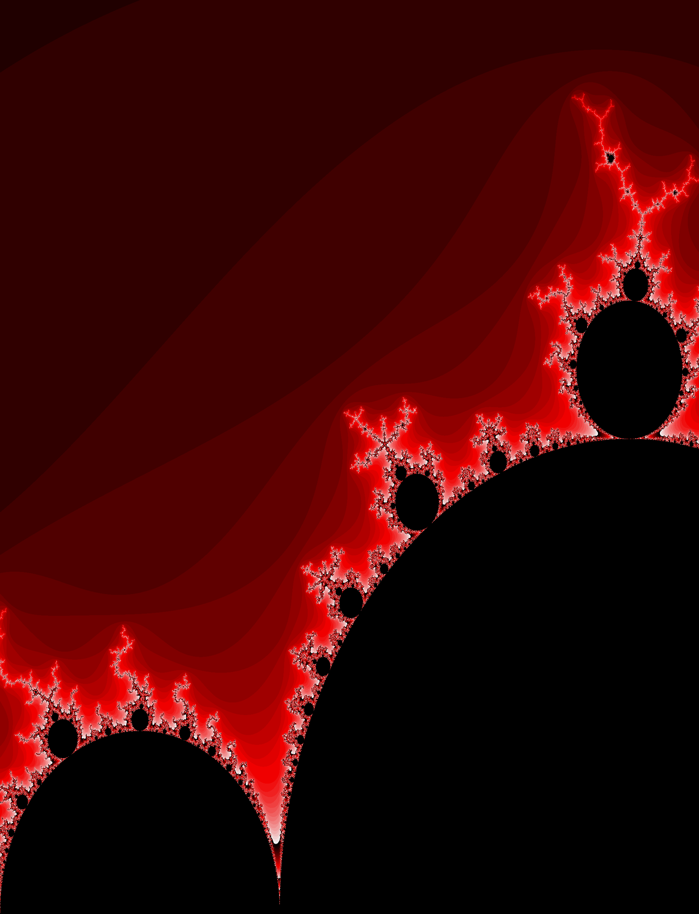  

- Pthread version（固定使用一顆 node、一個 process、12 條 threads，process 可以使用的 core 數為 12 個）

    針對時間的測量，主要需要關心的是單一 thread 花費在處理計算工作上的時間，這邊我是將上述提到的 `std::chrono::steady_clock::now()` 去夾在 thread 被 assign 的 function 前後去得到 thread 的總執行時間，但這之中可能包含了 thread 在 acquire 計算工作時被 mutex 擋下的時間。因此在以下的實驗結果中，我有再從總執行時間內扣除 locking 的 waiting time 來獲得實際花費在計算上的時間。

    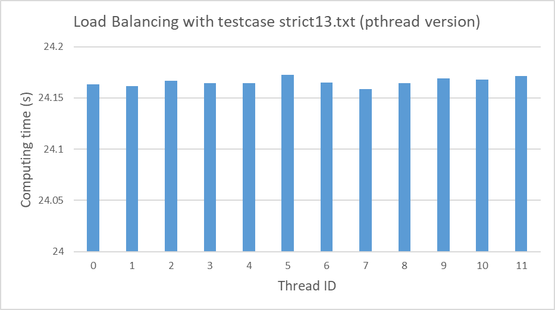 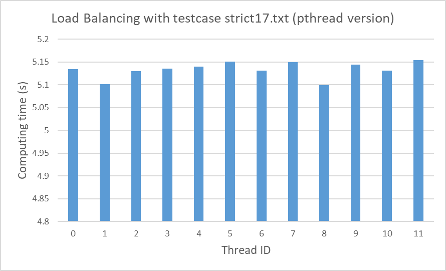

    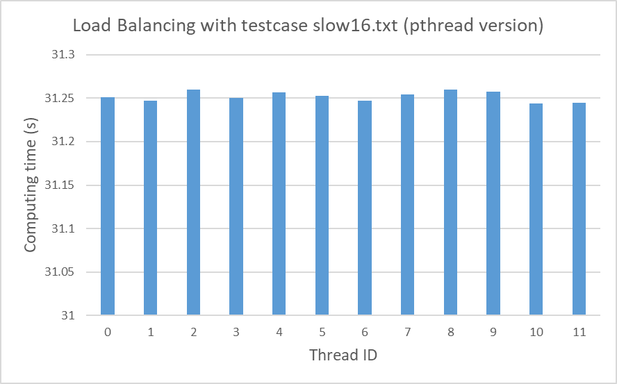

    在我的實作當中，由於座標是 sequential 的被 acquire，所以每個座標其實就有點像是機率性的被分配到每個 thread 作計算。因此，上述的實驗結果其實是我針對單一測資做了數次實驗取平均之後的結果。平均來看，使用 sequential 的 loading 分配搭上 dynamic load balancing 可以達到還算滿均勻的 load balancing。

- Hybrid version（固定使用四顆 nodes、四個 processes、12 條 threads，每一個 process 可以使用的 core 數為 3 個）

    除了 threads 之間的 load balancing 之外，在 hybrid version 中，processes 之間的 load balancing 也是極為重要。因此相較於 pthread version，這邊我多觀察了每個 process 的總執行時間，該時間包含了計算的時間、MPI 溝通的時間以及最後 PNG I/O 的時間（rank 0 的 process 負責）。時間的計算上則是使用了 MPI library 提供的 `MPI_Wtime()` 以及 OpenMP library 提供的 `omp_get_wtime()`。

    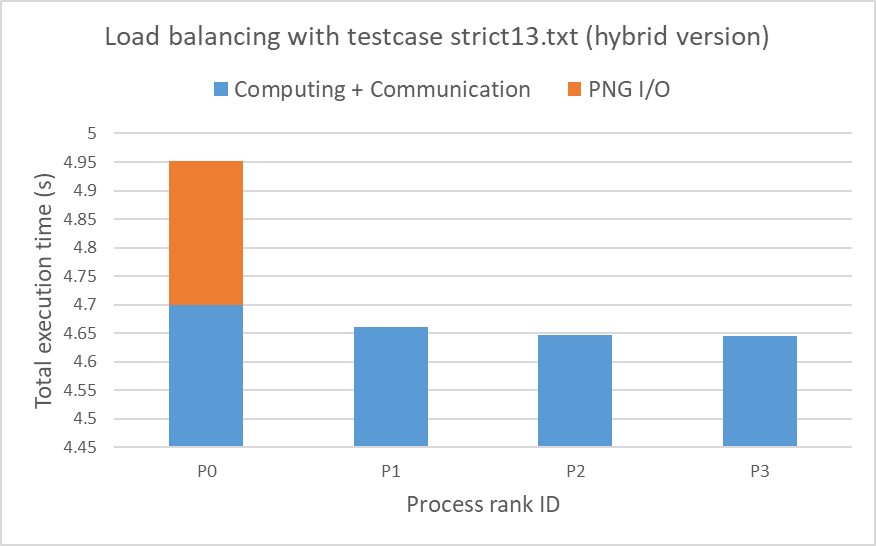 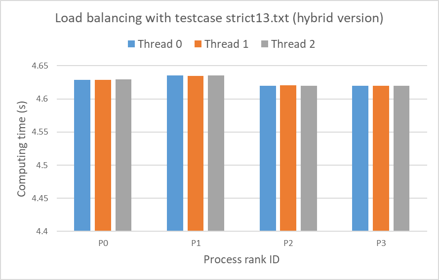

    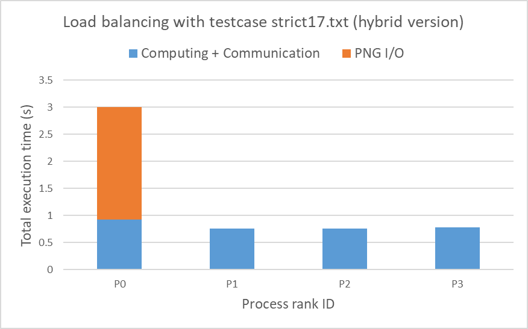 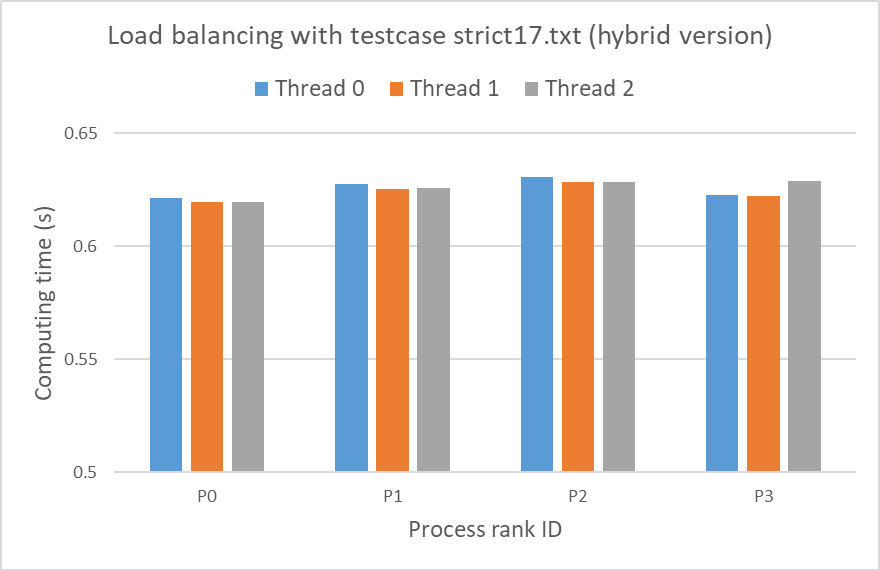

    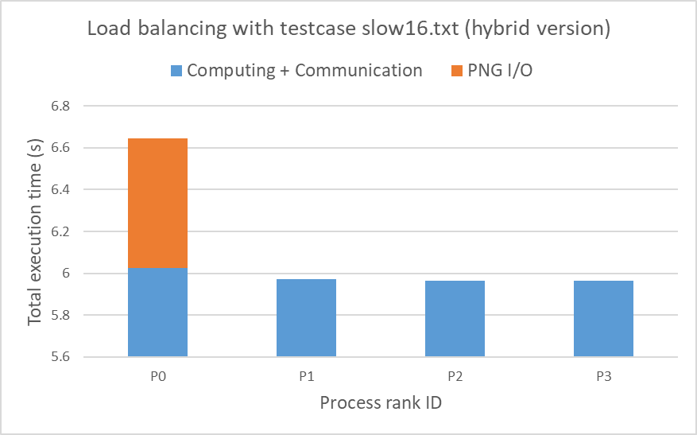 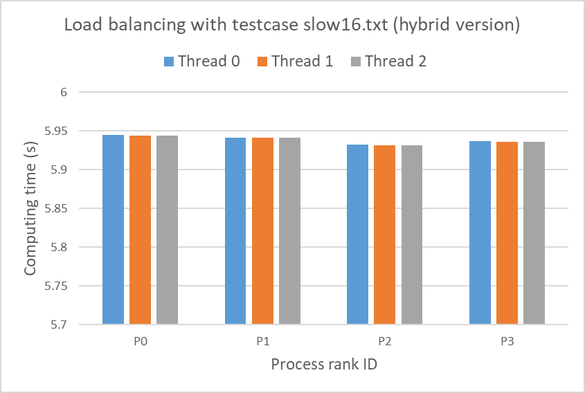

    整體上來看，thread-level 的 load balancing 依舊表現得十分均勻，無論是在 in process 或是 cross processes 的比較上都有很穩定的表現。然而，在 process-level 的 load balancing 上就表現的相對不均勻，可以看到 rank 0 的 process 因為負責了最後整張圖片的 PNG I/O，相比其他 processes 多出了一些 memory management、pixel color preprocessing 以及 I/O 的時間，所以基本上整個 program 的 worst case runtime 就被其給 bound 住。一個可能的優化方向是讓每個 process 獨立處理自己的計算結果並獨立做 PNG I/O，這樣不僅可以讓 rank 0 的 process 在做 PNG I/O 時的負擔降低，同時也可以省下 MPI 溝通的時間成本。

#### Strong scalability

這邊我使用測資 strict13.txt 來針對 pthread version 以及 hybrid version 做 strong scalability 的實驗。

- Pthread version（固定使用一顆 node、一個 process，測試使用不同 threads 數）

    在計算總執行時間上，這邊我主要是將 `std::chrono::steady_clock::now()` 夾在 main function 的前後來獲得時間差。

    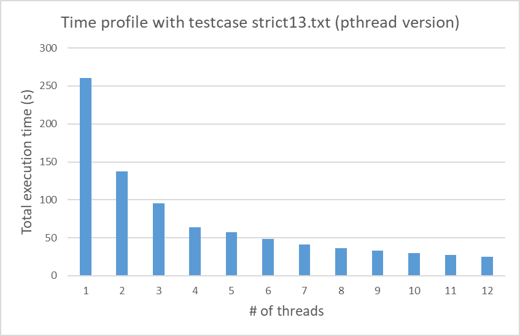 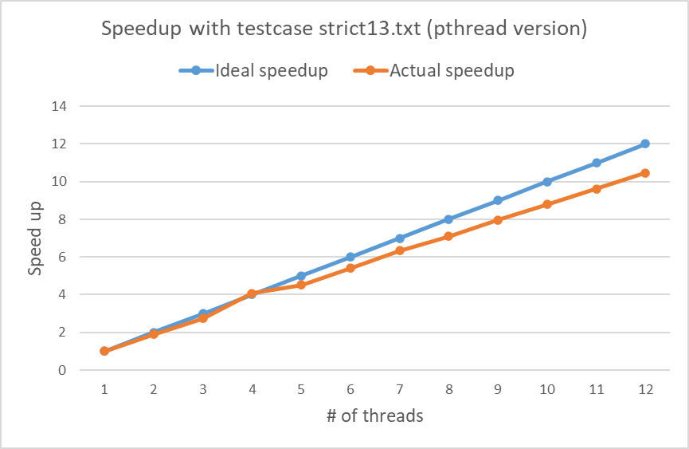

    從結果上來看，整體的 strong scalability 還算不錯，實際的 speedup 和理想的 speedup 也滿接近的。相較於在 hw1 中做的實驗，因為少了 communication 的 overhead 以及很大一部份 I/O 的影響，單純只留下了計算上的貢獻，所以在這邊我們能夠看到很好的 strong scalability。
    
    然而真要說會稍微影響到 scalability 的部分的話，問題可能就是出在 threads acquire 計算工作時的 mutex locking。當 threads 的數量增多時，這部分的影響就會比較容易顯現出來，因為一起等的人變多，可能就會需要等比較長的時間才能拿到 lock 來 acquire 計算工作，這也解釋了為甚麼在 speedup 上升的後半段，實際和理想的 speedup 差距會越來越大。

- Hybrid version（固定使用四顆 nodes、四個 processes，測試在每個 process 上使用不同 threads 數）

    在計算 program 的總執行時間上，因為在 hybrid version 中有加入了 process-level 的平行度，總執行時間會受限於跑最慢的 process，所以這邊我是先透過 `MPI_Wtime()` 去夾在 main function 的前後來獲得每個 process 的執行時間，最後再透過 `MPI_Reduce()` 將所有 processes 的執行時間 reduce 到 rank 0 的 process 取最大值，該最大值即為 program 的總執行時間。

    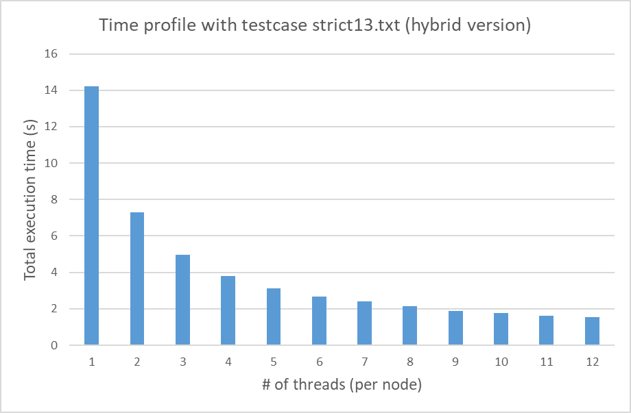 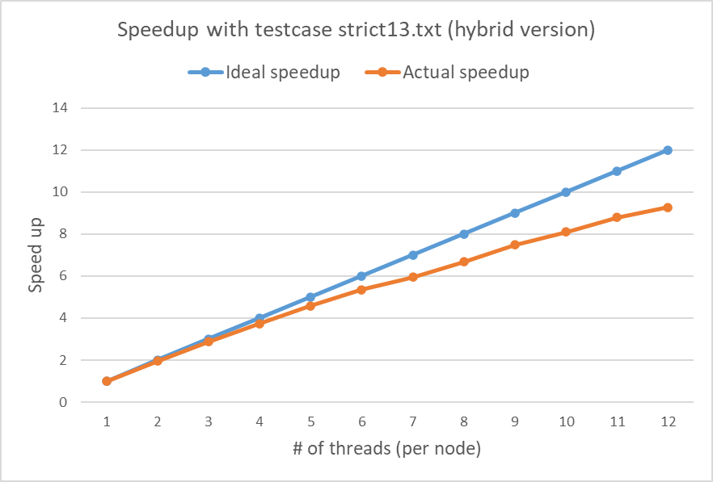
    
    從結果上來看，hybrid version 整體的 scalability 還算不錯，實際的 speedup 和理想的 speedup 也還算接近。然而，從圖中可以發現 hybrid version 在 speedup 上升的後半段表現上，實際和理想 speedup 的差距變化趨勢相比 pthread version 來得劇烈很多。這邊我想可能是因為和 pthread version 相比，hybrid version 多出了一些 communication 的 overhead，抑或是因為被負責最後 PNG I/O 的 rank 0 的 runtime 給 bound 住，進而導致了更劇烈的 speedup 下降。

## Discussion

- Compare and discuss the scalability of your implementations.

    從上面實驗的結果來看，無論是 pthread version 還是 hybrid version 的實作，由於 communication 的 overhead 以及 mutex locking 的等待時間在此次的任務中對整個 program 的表現影響並不大，因此兩個版本的實作都擁有滿好的 strong scalability。然而如果比較仔細地觀察兩個版本的 speedup 上升趨勢的話，還是可以發現實作上需要 processes 之間互相溝通的 hybrid version，在實際和理想 speedup 的差距變化上還是相對較大的。
    
- Compare and discuss the load balance of your implementations.

    在檢驗兩個版本實作 load balancing 的表現上，為了排除對於特定單筆測資表現很好，其他測資卻表現很差的情況，在測資的選擇上我特意選擇了三筆比較不同的座標分布，來觀察是否這兩個版本的實作針對選擇的三筆測資都擁有很好的 load balancing。

    平均來看，可以發現 thread-level 的 load balancing 在不管是 pthread version 還是 hybrid version 的實作當中，都擁有很均勻的表現，說明了 sequential 的 task acquire 搭配上 dynamic load balancing 依舊可以表現的相對不錯。

    然而，在 process-level 的 load balancing 上，由於 rank 0 的 process 負責了所有計算結果的 PNG I/O，再加上 MPI 溝通可能的影響，導致了整體 program 的 runtime 被負擔最重的 rank 0 給 bound 住，成為了可能的效能瓶頸。而如果要想解決這個問題，一個可能的優化方向就是讓每個 process，甚至是讓每個 thread，獨立的去處理被分配到的計算工作，並在工作完成之後獨立的去做 PNG I/O。這樣的實作概念不僅減少了 rank 0 的負擔，也避免了 MPI 溝通的實作，進而去降低了溝通的時間成本。

## Conclusion

這次作業實作上並不困難，但需要花點時間思考如何 evenly 地分配計算工作給 threads 以及 processes。如果分配工作的 loading 不平衡，整支 program 的效能瓶頸就會受限於跑最慢的那支 process 或是 thread，導致整個 program 的 scalability 很差。因此，學會如何做好 load balancing，在平行程式的世界裡也是相當重要的。藉由這次作業的實作，我嘗試了許多不同的方法來分配計算的 loading，從中學到了很多，也希望透過這次的學習讓我之後在面對類似的 task 時能夠更加得心應手。