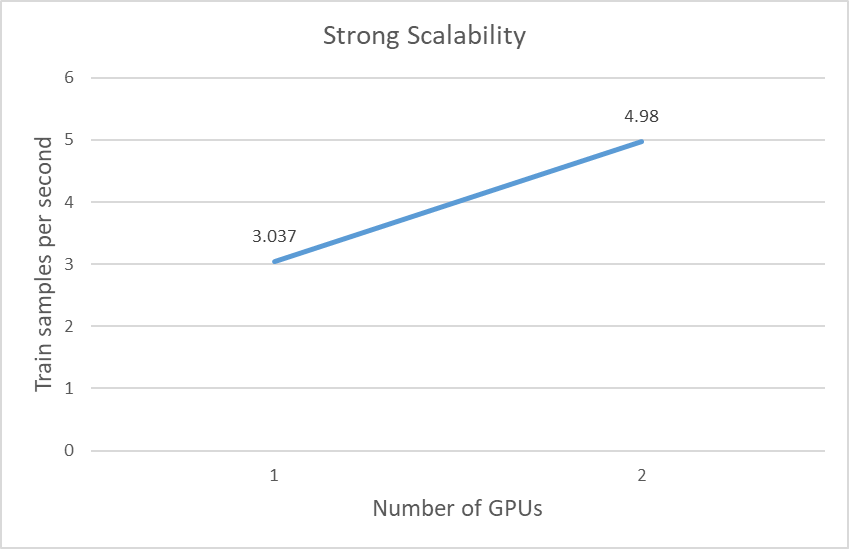

# CS542000 Parallel Programming Lab7 Report

- 學號：108022138
- 姓名：楊宗諺

## Experiment Procedure

這邊我單純就是在 hades 上利用 given 的 `run_DDP_1GPU.sh` 以及 `run_DDP_2GPU.sh` submit `run_clm.py` 的 running job 到 slurm 上去跑，最後再從輸出的 .out 檔中提取 `train_samples_per_second` 的 training metrics 來作分析。

## Experiment Result - Strong Scalability

以下是針對使用不同數量的 GPU 利用 data parallel 的 training 方式來觀察每秒能夠處理的 training samples 的數量所做的實驗。

從中可以發現當使用的 GPU 數量變多，每秒能夠處理的 training samples 的數量也會跟著提升，畢竟使用的是 data parallel 的 training 方式。此外，我們也可以發現 training samples 處理量的上升幅度並沒有達到 perfect strong scalability，其中的原因可能是出在 communication 的 overhead，在不同的 GPU card 上訓練的同個模型可能會需要同步 gradient 以及參數的更新，其中衍生出來的溝通成本可能就導致了 strong scalability 的下降。