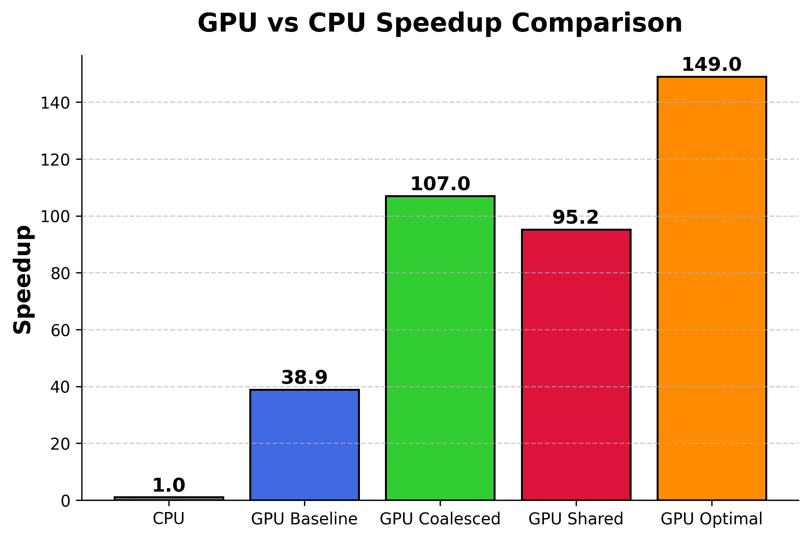

# Solving Matrix Chain Product Problem on GPUs

This project implements a GPU-accelerated dynamic programming algorithm for the Matrix Chain Product Problem (MCP) using **CUDA**. The implementation is based on the paper: "**Accelerating the Dynamic Programming for the Matrix Chain Product on the GPU**" by Kazufumi Nishida, Yasuaki Ito, and Koji Nakano (IEEE ICNC 2011).

## Overview

The Matrix Chain Product Problem seeks the optimal parenthesization of a matrix sequence to minimize scalar multiplications. The standard dynamic programming solution runs in $\mathbb{O}(n^3)$ time and $\mathbb{O}(n^2)$ space.

This project accelerates the solution by leveraging **GPU parallelism**, optimizing:

- Coalesced memory accesses for efficient global memory transactions
- Potential shared memory usage to reduce memory access latency
- Loop unrolling and warp-aware execution for performance improvements

## Problem Definition

**Matrix Chain Product Problem** is an optimization problem for finding parentheses of the matrix chain that gives the minimum total number of multiplications necessary to compute the product of the matrix chain. 

Suppose that a chain of three or more matrices to be multiplied is given. The total number of multiplications may vary depending on the order of multiplication as depicted below.

## GPU Implementations

A standard DP table is computed bottom-up. GPU parallelization assigns table entries to threads while respecting data dependencies:

- Baseline: Naively offload tasks to GPU without considering any memory optimizations
- Coalesced: Consider coalescing effect to reduce global memory transactions (super effective!!)
- Shared: Consider potential per-block shared memory usage for faster memory accesses
- Optimal: Minimize redundant memory accesses to further improve performance

## Results

The GPU implementations are evaluated on an NVIDIA T4 GPU with 2560 CUDA cores (64 cores per SM) and 16GB memory (up to 320+ GB/s bandwidth). For comparison, a traditional CPU implementation is also tested on a **13th Gen Intel® Core™ i7-13700**, which features **8 performance cores, 8 efficiency cores, and 24 threads**. The CPU implementation includes both **a single-threaded version** and a **multithreaded version**, with the latter leveraging parallel execution across multiple cores to ensure a fair comparison with the GPU.

The GPU experimental configurations follow the original paper, using **N = 16,384** and the **oneThreadPerEntry** computation pattern. For the block size, values in **{32, 64, 128, 256}** are tested, and the best-performing configuration is selected for comparison.

||  CPU   | GPU_baseline | GPU_coalesced | GPU_shared | GPU_optimal |
|:-:| :-:  | :-:  | :-: | :-: | :-: |
| Execution time (ms) | 7,561,300  | 194,250 | 70,783.3 | 79,401.6 | 50,736.4 |

The maximum speedup reaches approximately **149x** compared to the traditional single-threaded CPU implementation, benefiting from **high GPU parallelism** and the **optimizations** discussed above.

## Conclusion

This project showcases the effectiveness of a **GPU-accelerated dynamic programming solution** for the **Matrix Chain Product Problem (MCP)**, achieving a significant reduction in execution time.

## References

[1] **Kazufumi Nishida, Yasuaki Ito, and Koji Nakano,** "Accelerating the Dynamic Programming for the Matrix Chain Product on the GPU," *2011 Second International Conference on Networking and Computing (ICNC)*, Higashihiroshima, Japan, 2011, pp. 320-326, doi: [10.1109/ICNC.2011.62](https://doi.org/10.1109/ICNC.2011.62).
